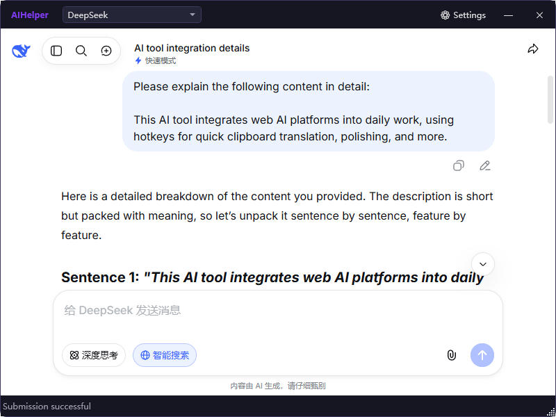
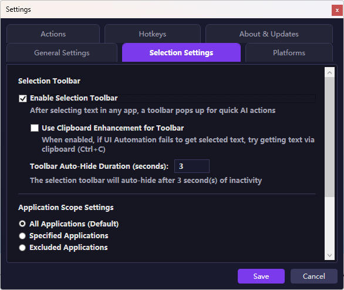
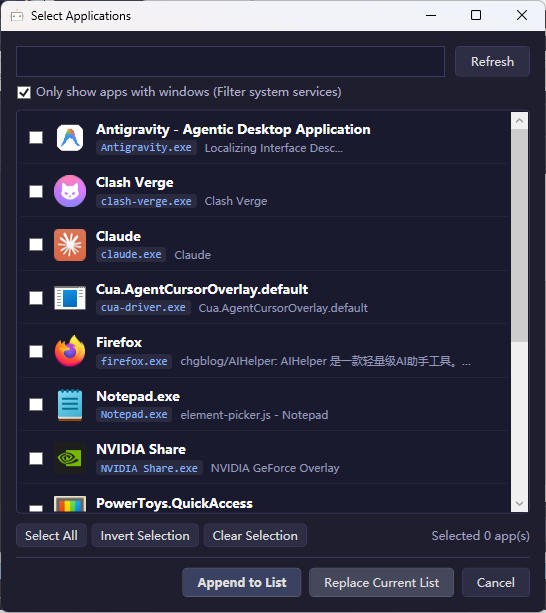
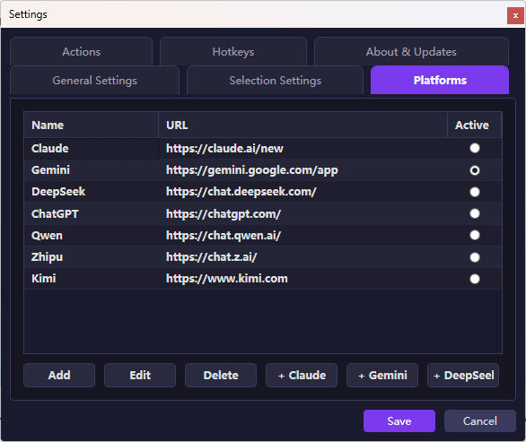
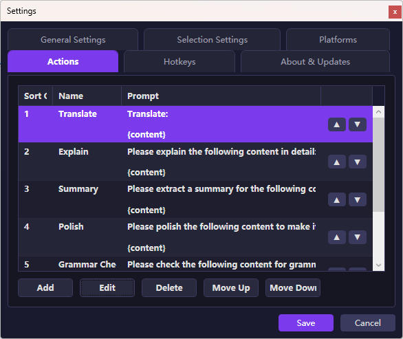
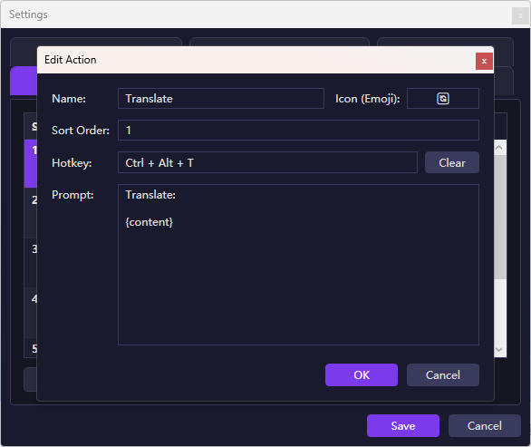

# AIHelper

**English** | [中文](README_ZH.md)

AIHelper – Your Global AI Productivity Engine for Windows.

Stop copying, pasting, and switching tabs. AIHelper seamlessly embeds leading LLMs (ChatGPT, Claude, Gemini, DeepSeek, Qwen, etc.) directly into your workflow. With a selection-triggered floating toolbar, global hotkeys, and smart web injection, instantly translate, explain, summarize, polish, or grammar-check any text. Lightweight, unobtrusive, and always ready — making AI a native part of your desktop experience.


<a href="https://github.com/chgblog/AIHelper/releases">

</a>

https://github.com/user-attachments/assets/8a797c85-6701-4d8b-87dc-3e03127509cd

---

## 📸 Screenshots

### 1. Main Window (AI Result Interface)


### 2. Text Selection AI Toolbar


### 3. Selection Settings


### 4. Selection App Settings


### 5. Platform Management


### 6. Action Management


### 7. Action Editing


---

## ✨ Key Features

- **✨ Text Selection AI Assistant Toolbar**
  - Select text in any application using your mouse, and a minimal floating AI toolbar will automatically appear next to your cursor.
  - One-click prompt execution directly from the floating toolbar without pressing keyboard shortcuts.
  - **Intuitive Interactions & Customization**: Right-click anywhere on the toolbar to immediately dismiss it; optional "Copy" button (configurable: disabled, first position, or last position); customizable auto-hide countdown and anti-overlap positioning.
  - **Target Application Scope**: Filter by "All Applications", "Include Applications", or "Exclude Applications" with a visual process picker dialog.

- **🚀 Global Hotkeys & Action Panel**
  - Press the global hotkey (default `Ctrl+Alt+Space`) to bring up the quick action panel.
  - Press the open-main-window hotkey (default `Shift+Space`) to toggle the main window (press to activate/bring to front, press again to hide with cycle toggle support).
  - Select or copy text, then press a hotkey (e.g., `Ctrl+Alt+T`) to send it directly to AI for processing.
  - **🛡️ Real-Time Hotkey Conflict Detection**: Real-time validation when setting hotkeys against panel hotkey, main window hotkey, action shortcuts, or system/third-party occupied hotkeys to prevent failures.
  - Supports **custom action ordering** (Move Up / Move Down) and standalone dialog editing in settings.

- **🌐 Multi-AI Platform Integration, Per-Platform Proxy & Action Routing**
  - Built-in preset support for 7 major AI platforms: **DeepSeek**, **Claude**, **Gemini**, **ChatGPT**, **Qwen**, **Zhipu**, and **Kimi**.
  - **🔀 Action-Specific Platform Routing**: Each prompt action can be independently bound to a specific AI platform (e.g., DeepSeek for Translation, Claude for Polishing, or use Default active platform) for specialized multi-model workflows.
  - **🌐 Per-Platform Independent Proxy**: Each platform can independently toggle whether to route through the configured network proxy or connect directly.
  - **🎯 Visual DOM Element Picker**: Customize CSS selectors for "New Chat", "Input Box", and "Submit Button". Built-in WebView2 element picker allows clicking elements directly on live webpages to inspect and retrieve CSS selectors effortlessly.
  - **🔄 Automatic New Chat**: Supports configuring a "New Chat" selector to automatically click and initiate a fresh conversation before sending prompts.

- **⚡ Intelligent DOM Script Injection & Auto-Submit Control**
  - Built-in `injector.js` script that automatically identifies and locates text input fields on major AI platforms.
  - Robust retry, load-waiting, and injection mechanisms across platform switches, ensuring stable prompt injection and configurable **Auto Submit** toggle (auto send vs. manual confirmation).

- **🖥️ Main Window Quick Actions & Modern UX**
  - **Status Bar Quick Action Bar**: Quick action buttons and a "More ▾" menu embedded right in the bottom status bar of the main window for one-click prompt execution without selecting text.
  - **Window Maximize & Restore**: Maximize/restore window controls and double-click title bar support.

- **📦 Configuration Management & Backup / Restore**
  - One-click export and backup of all platform, action, hotkey, and preference configurations to a JSON file, with easy restore and quick access to the config directory.

- **🔔 Automatic Update Check & Non-Intrusive Notifications**
  - Background auto-check for new GitHub releases; subtle "Update" badge and tip displayed next to the Settings button in the main window title bar without disruptive modal popups.

- **🌐 Multi-Language Interface (I18n)**
  - Built-in Language Manager supporting dynamic switching between **Simplified Chinese** and **English**, auto-adapting to local time zone.

- **💻 Modern & Lightweight UI with System Tray**
  - Built with WPF and Microsoft WebView2 for a smooth web browsing and interaction experience.
  - System tray context menu provides quick controls ("Open Settings", "Enable/Disable Selection Helper").
  - Local configuration storage (`%APPDATA%\AIHelper\settings.json`) to protect privacy and avoid repeated logins.

---

## ⌨️ Default Hotkeys

| Hotkey | Action | Prompt Description |
| :--- | :--- | :--- |
| `Shift + Space` | Show/Hide Main Window | Cycle toggles the main window visibility |
| `Ctrl + Alt + Space` | Show/Hide Action Panel | Opens the quick action list panel |
| `Ctrl + Alt + T` | Translate | Translates selected text to Chinese |
| `Ctrl + Alt + E` | Explain | Provides a detailed explanation of the selected text |
| `Ctrl + Alt + S` | Summarize | Extracts a core summary from the selected text |
| `Ctrl + Alt + R` | Polish | Polishes the selected text for fluency and professionalism |
| `Ctrl + Alt + G` | Grammar Check | Checks for grammatical errors and suggests corrections |
| `Ctrl + Alt + O` | Summary (Summarize) | Summarizes the selected text |

> *Note: All hotkeys can be reconfigured in the application's Settings window with real-time conflict detection.*

---

## 🛠️ Tech Stack & Dependencies

- **Runtime / Framework**: .NET Framework 4.8 / WPF (Windows Presentation Foundation)
- **Web Browser Engine**: [Microsoft.Web.WebView2](https://www.nuget.org/packages/Microsoft.Web.WebView2)
- **JSON Serialization**: [Newtonsoft.Json](https://www.nuget.org/packages/Newtonsoft.Json)
- **Single-File Packaging**: [Costura.Fody](https://www.nuget.org/packages/Costura.Fody)
- **Script Injection Bridge**: Vanilla JavaScript (`injector.js` / `element-picker.js`)

---

## 📁 Project Structure

```text
AIHelper/
├── AIHelper.sln                # Visual Studio solution file
└── AIHelper/
    ├── AIHelper.csproj         # Project file
    ├── App.xaml / App.xaml.cs  # Application entry point & global resources (with tray menu)
    ├── Assets/
    │   ├── injector.js         # JS script for web page automation injection
    │   └── element-picker.js   # JS script for visual DOM element picking
    ├── Converters/             # XAML data converters
    │   ├── BoolToVisibilityConverter.cs
    │   └── PlatformIdToNameConverter.cs
    ├── Models/
    │   ├── ActionItem.cs       # Action item data model (with platform binding/ordering)
    │   ├── AiPlatform.cs       # AI platform data model (with independent proxy/selectors)
    │   ├── AppItem.cs          # Application data model (for selection app scope filtering)
    │   └── AppSettings.cs      # App settings & defaults (proxy, language, text selection)
    ├── Services/
    │   ├── AppInfoService.cs   # App information & version service
    │   ├── AutoStartService.cs # Auto-start service
    │   ├── ClipboardService.cs # Clipboard access & key simulation service
    │   ├── HotkeyService.cs    # Global hotkey listener & conflict detection (Win32 API)
    │   ├── LanguageManager.cs  # Multi-language / I18n dynamic switching service
    │   ├── Logger.cs           # Logging service
    │   ├── PageInjector.cs     # Web JS script injection & execution service
    │   ├── SettingsService.cs  # Local JSON config loading, persistence & backup/restore
    │   ├── TextSelectionService.cs # Text selection & floating toolbar listener service
    │   └── UpdateCheckService.cs   # GitHub Release update detection service
    └── Views/
        ├── ActionEditWindow.xaml   # Standalone action editing dialog (with platform binding)
        ├── ActionPanelControl.xaml # Quick action floating panel view
        ├── AppSelectionWindow.xaml # Visual application process picker dialog
        ├── ElementPickerWindow.xaml# Visual DOM element picker window
        ├── MainWindow.xaml         # Main window (with WebView2 control & status action bar)
        ├── PlatformEditWindow.xaml # Platform editing & selector configuration window (with proxy)
        ├── SelectionToolbarWindow.xaml # Text selection AI floating toolbar window
        └── SettingsWindow.xaml     # Settings window (platform/action/selection/proxy/language)
```

---

## 🚀 Build & Run

### 1. Prerequisites

- **Operating System**: Windows 10 / Windows 11
- **Development Tools**: Visual Studio 2019 / 2022 (with **.NET Desktop Development** workload installed) or .NET SDK
- **SDK Requirement**: .NET Framework 4.8 Developer Pack
- **Runtime Requirement**: [Microsoft Edge WebView2 Runtime](https://developer.microsoft.com/en-us/microsoft-edge/webview2/) (built-in on Win11, usually auto-installed with Edge on Win10)

### 2. Build Steps

1. Clone or download the project source code:
   ```bash
   git clone https://github.com/chgblog/AIHelper.git
   cd AIHelper
   ```
2. Open `AIHelper.sln` in Visual Studio.
3. Select `Any CPU` or `x64` platform and choose `Debug` or `Release` configuration.
4. Press `F5` to run or `Ctrl+Shift+B` to build the solution.

### 3. Single-File Packaging (Single EXE)

This project integrates **Costura.Fody** to merge all dependency DLLs and `injector.js` static resources into a single standalone `.exe` file:

- **Build via command line**:
   ```bash
   dotnet build AIHelper/AIHelper.csproj -c Release
   ```
- **Output**:
   The packaged single file is located at `AIHelper/bin/Release/net48/AIHelper.exe`. You can copy `AIHelper.exe` (along with `AIHelper.exe.config`) to any location and run it independently — no additional DLLs or `Assets/` directory required.

---

## Verify GitHub Actions

Verify that the downloaded file is automatically compiled and packaged from source code by GitHub Actions.

- **Verify the file hash (Windows PowerShell):**
```
Get-FileHash .\AIHelper.zip -Algorithm SHA256
```

- **Verify the official GitHub build attestation (using GitHub CLI):**
```
gh attestation verify AIHelper.zip --repo chgblog/AIHelper
```

---

## 🔗 Community

- **[linux.do](https://linux.do)** - A community you always feel like visiting.

## 📄 License

Released under the [GNU General Public License v3.0](LICENSE).
