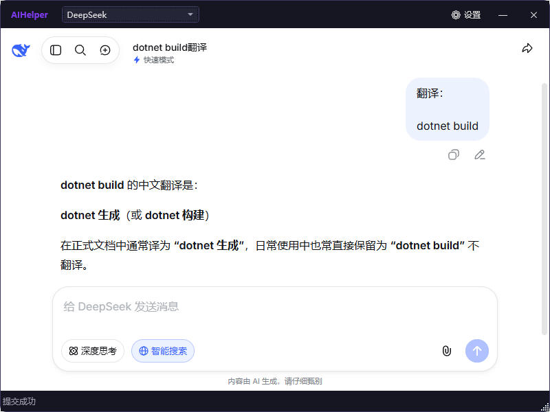
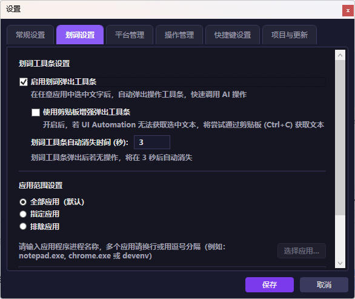
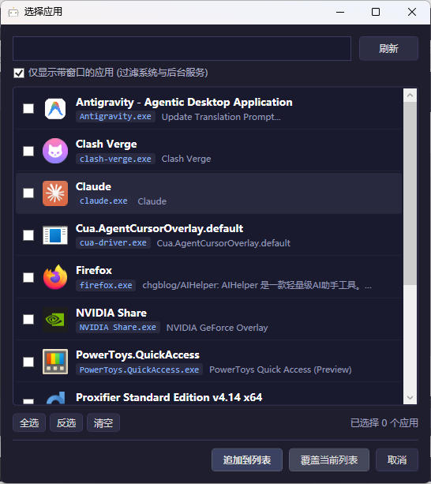
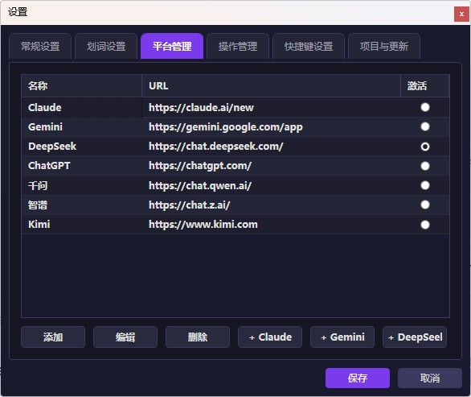
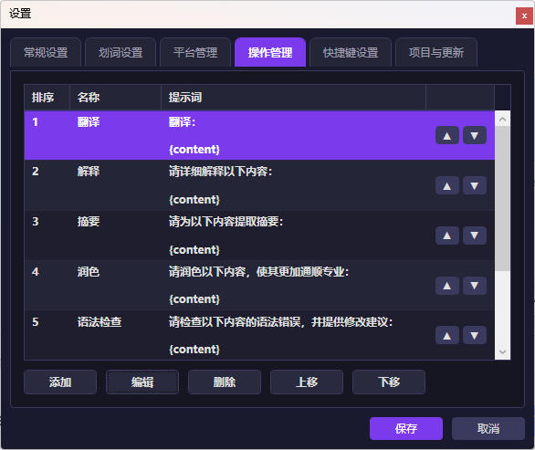
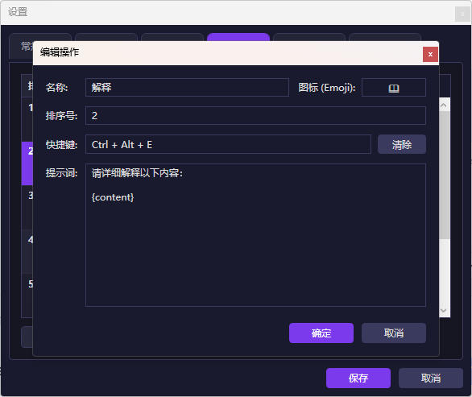

# AIHelper

**中文** | [English](README.md)

AIHelper —— 你的 Windows 全局 AI 效率引擎。

告别繁琐的复制粘贴与窗口切换，AIHelper 将 DeepSeek、通义千问、ChatGPT、Claude、Gemini 等主流大模型无缝嵌入你的工作流。通过 划词即现工具条、全局快捷键 及 智能网页注入，一键完成翻译、解释、摘要、润色与语法检查。轻量、无感、即用即走，让 AI 真正成为你的桌面原生能力。


<a href="https://github.com/chgblog/AIHelper/releases">

</a>

https://github.com/user-attachments/assets/5b0386f3-706b-4be9-bb22-960bb03d147a

---

## 📸 界面展示

### 1. 主窗口（AI 结果显示界面）


### 2. 划词 AI 工具条


### 3. 划词设置


### 4. 划词应用设置


### 5. 平台管理


### 6. 操作管理


### 7. 操作编辑


---

## ✨ 核心特性

- **✨ 划词 AI 助手工具条 (Text Selection Helper)**
  - 在任意软件中用鼠标划词选中文本，自动在光标旁浮现极简 AI 悬浮工具条。
  - 支持直接点击工具条上的 Prompt 动作一键处理选中文本，无需键盘快捷键。
  - 可在托盘右键菜单或设置窗口中随时开启/关闭划词检测，并可配置动画与防遮挡避让。

- **🚀 全局快捷键与动作面板**
  - 按下全局快捷键（默认 `Ctrl+Alt+Space`）调出快捷动作面板。
  - 按下打开主界面快捷键（默认 `Ctrl+Alt+1`）可随时唤醒并激活主窗口。
  - 支持划词选中或复制文本后，直接通过快捷键（如 `Ctrl+Alt+T`）一键发送给 AI 处理。
  - 支持在设置界面对所有快捷动作进行**自定义排序**与独立弹窗编辑。

- **🌐 多 AI 平台集成与精准定位**
  - 内置 7 大主流 AI 平台预设：**DeepSeek**、**Claude**、**Gemini**、**ChatGPT**、**千问**、**智谱**、**Kimi**。
  - 支持添加、编辑、删除自定义 AI 平台，通过单选框轻松切换当前激活平台。
  - **🎯 可视化 DOM 元素拾取器**：支持自定义“新会话”、“输入框”及“提交按钮”的 CSS 选择器；内置 WebView2 拾取模式，悬停/点击网页元素即可自动捕获高精度选择器。
  - **🔄 自动开启新会话**：支持配置“新会话选择器”，在每次发送 Prompt 前自动点击开启全新对话。

- **⚡ 智能 DOM 脚本注入与提交控制**
  - 内置 `injector.js` 脚本，自动识别并定位各大 AI 平台的网页文本输入框。
  - 自动填充 Prompt 模板与选中文本，并支持设置**是否开启自动发送/提交**。

- **🛠️ 高度可定制的 Prompt 动作 (Actions)**
  - 预设常用动作：**翻译**、**解释**、**摘要**、**润色**、**语法检查**。
  - 用户可自由修改 Prompt 模板、添加/编辑/删除动作、调整动作排序及自定义快捷键。

- **🌐 界面多语言支持 (Internationalization)**
  - 内置语言管理器，支持**简体中文**与 **English** 双语界面随时动态切换。

- **🔧 代理与网络/更新配置**
  - 支持自定义 HTTP / HTTPS / SOCKS 网络代理，保障各 AI 平台的网络连通性。
  - 支持配置项目主页与检查更新 URL。

- **💻 现代且轻量的 UI 与系统托盘**
  - 基于 WPF 构建，结合 Microsoft WebView2 提供流畅的网页浏览与交互体验。
  - 系统托盘图标右键菜单支持快捷「打开设置」、「开启/关闭划词搜索」等便捷控制。
  - 本地化配置存储（保存路径：`%APPDATA%\AIHelper\settings.json`），保护隐私且免去重复登录。

---

## ⌨️ 默认快捷键

| 快捷键 | 动作 / 功能 | 提示词说明 (Prompt) |
| :--- | :--- | :--- |
| `Ctrl + Alt + Space` | 唤醒/隐藏快捷动作面板 | 调出动作列表面板选择执行 |
| `Ctrl + Alt + T` | 翻译 (Translate) | 将选中文本翻译为中文 |
| `Ctrl + Alt + E` | 解释 (Explain) | 详细解释选中文本内容 |
| `Ctrl + Alt + S` | 摘要 (Summarize) | 为选中文本提取核心摘要 |
| `Ctrl + Alt + R` | 润色 (Polish) | 润色选中文本使其通顺专业 |
| `Ctrl + Alt + G` | 语法检查 (Grammar) | 检查语法错误并提供修改建议 |

> *注：所有快捷键均可在应用“设置”窗口中重新配置。*

---

## 🛠️ 技术栈与依赖

- **运行环境 / 框架**：.NET Framework 4.8 / WPF (Windows Presentation Foundation)
- **网页浏览器内核**：[Microsoft.Web.WebView2](https://www.nuget.org/packages/Microsoft.Web.WebView2)
- **JSON 序列化**：[Newtonsoft.Json](https://www.nuget.org/packages/Newtonsoft.Json)
- **单文件打包**：[Costura.Fody](https://www.nuget.org/packages/Costura.Fody)
- **脚本注入桥梁**：Vanilla JavaScript (`injector.js` / `element-picker.js`)

---

## 📁 项目结构

```text
AIHelper/
├── AIHelper.sln                # Visual Studio 解决方案文件
└── AIHelper/
    ├── AIHelper.csproj         # 项目工程文件
    ├── App.xaml / App.xaml.cs  # 应用入口与全局资源 (含系统托盘菜单)
    ├── Assets/
    │   ├── injector.js         # 自动化注入网页的 JS 脚本
    │   └── element-picker.js   # 网页 DOM 元素可视化拾取 JS 脚本
    ├── Models/
    │   ├── ActionItem.cs       # 快捷动作数据模型 (含划词/排序)
    │   ├── AiPlatform.cs       # AI 平台数据模型 (含新会话/选择器)
    │   └── AppSettings.cs      # 应用配置与默认设置 (代理/语言/划词设置)
    ├── Services/
    │   ├── AutoStartService.cs # 开机自启服务
    │   ├── ClipboardService.cs # 剪贴板获取与模拟按键服务
    │   ├── HotkeyService.cs    # 全局 Hotkey 注册与监听服务 (Win32 API)
    │   ├── LanguageManager.cs  # 多语言/国际化 (I18n) 动态切换服务
    │   ├── Logger.cs           # 日志记录服务
    │   ├── PageInjector.cs     # 网页 JS 脚本注入与执行服务
    │   ├── SettingsService.cs  # 本地 JSON 配置加载与持久化
    │   └── TextSelectionService.cs # 划词选中文本与悬浮工具条监听服务
    ├── Views/
    │   ├── ActionEditWindow.xaml   # 快捷动作独立编辑窗口
    │   ├── ActionPanelControl.xaml # 快捷动作悬浮面板视图
    │   ├── ElementPickerWindow.xaml# 网页 DOM 元素可视化拾取窗口
    │   ├── MainWindow.xaml         # 主界面（含 WebView2 控件）
    │   ├── PlatformEditWindow.xaml # 平台编辑与元素定位配置窗口
    │   ├── SelectionToolbarWindow.xaml # 划词 AI 悬浮工具条窗口
    │   └── SettingsWindow.xaml     # 设置界面（平台/动作/划词/代理/语言配置）
    └── Converters/             # XAML 数据转换器
```

---

## 🚀 编译与运行

### 1. 前置条件

- **操作系统**：Windows 10 / Windows 11
- **开发工具**：Visual Studio 2019 / 2022（需安装 **.NET 桌面开发** 工作负载）或 .NET SDK
- **SDK 要求**：.NET Framework 4.8 Developer Pack
- **运行时需求**：[Microsoft Edge WebView2 Runtime](https://developer.microsoft.com/en-us/microsoft-edge/webview2/)（Win11 已内置，Win10 通常随 Edge 自动安装）

### 2. 构建步骤

1. 克隆或下载本项目源码至本地：
   ```bash
   git clone https://github.com/chgblog/AIHelper.git
   cd AIHelper
   ```
2. 使用 Visual Studio 打开 [AIHelper.sln](file:///e:/CHG/develop/c%23/AIHelper/AIHelper.sln)。
3. 在 Visual Studio 顶部菜单选择 `Any CPU` 或 `x64` 平台，解决方案配置选择 `Debug` 或 `Release`。
4. 按下 `F5` 键运行或按 `Ctrl+Shift+B` 编译解决方案。

### 3. 单文件打包 (Single EXE Packaging)

本项目已集成 **Costura.Fody**，支持将依赖 DLL 及 `injector.js` 静态资源全部合并为单个独立的 `.exe` 文件：

- **通过命令行编译发布**：
  ```bash
  dotnet build AIHelper/AIHelper.csproj -c Release
  ```
- **生成产物**：
  打包后的单文件位于 `AIHelper/bin/Release/net48/AIHelper.exe`。您可以直接将 `AIHelper.exe`（及其同级配置文件 `AIHelper.exe.config`）复制到任意位置独立运行，无需附带任何 DLL 或 `Assets/` 资源目录。

---

## 📖 使用指南

1. **划词 AI 助手使用**：
   - 选中文本后，光标处将自动显示划词 AI 悬浮工具条，直接点击所需动作图标即可发送处理。
   - 可在系统托盘右键菜单或“设置 -> 划词设置”中随时开启/关闭划词搜索。
2. **配置与管理 AI 平台**：
   - 首次运行会自动打开设置窗口，内置 DeepSeek、Claude、Gemini、ChatGPT、千问、智谱、Kimi 等多个主流平台预设。
   - 点击“添加”或“编辑”平台，可修改平台 URL、“新会话”选择器、输入框及提交按钮选择器；点击“🎯 拾取”即可在真实网页中点击捕获目标元素选择器。
   - 可设置每次发送 Prompt 前是否自动触发“新会话”。
3. **文本划词/快捷处理**：
   - 在任何软件（如浏览器、Word、代码编辑器）中**复制**或**选中**需要处理的文本。
   - 按下对应快捷键（例如 `Ctrl+Alt+T`），AIHelper 将自动唤醒、切换至指定 AI 平台窗口、填入提示词并自动提交。
4. **面板与动作排序**：
   - 按下 `Ctrl+Alt+Space` 可快速召唤操作面板，点击需要的 AI 操作项即可。
   - 按下 `Ctrl+Alt+1` 可直接打开主界面；两个快捷键均可在“设置 -> 其他设置”中自定义。
   - 在“设置 -> 动作管理”中支持对动作进行**自定义排序**（上移/下移）及独立弹窗编辑。
5. **代理与语言设置**：
   - 支持在设置界面切换界面语言（中文 / English）以及配置 HTTP/HTTPS/SOCKS 网络代理。

---

## 📝 更新日志 (Changelog)

### > v0.3.5 至今的更新亮点

- **✨ 划词 AI 助手工具条 (Text Selection Toolbar)**
  - 新增划词选中文本监听服务，选中文本后自动浮现极简划词 AI 工具条，点击一键处理。
  - 优化划词检测灵敏度、防遮挡算法、弹出流畅度及托盘右键快捷开关。
- **🌐 多语言界面支持 (I18n)**
  - 新增系统级简体中文 (Simplified Chinese) / 英文 (English) 界面语言无缝动态切换。
- **🔄 平台“新会话”自动化**
  - AI 平台增加“新会话选择器”配置，可在每次执行 Prompt 前自动点击开启全新对话。
- **⚡ 自动提交控制 (Auto Submit)**
  - 新增“自动提交”选项开关，可自由选择充填 Prompt 后自动发送或手动回车提交。
- **⚙️ 动作管理与自定义排序**
  - 设置界面支持 Prompt 动作上移/下移自定义排序，并提供独立的 `ActionEditWindow` 编辑弹窗。
- **🌐 网络代理与项目/更新配置**
  - 新增 HTTP / HTTPS / SOCKS 代理支持；新增项目主页及检查更新 URL 配置。
- **📌 系统托盘右键菜单增强**
  - 托盘右键菜单增加「打开设置」、「开启/关闭划词搜索」快速切控与状态反馈。

---

## 🔗 友情链接 

- **[linux.do](https://linux.do)** - 没事儿就想去逛逛的社区

## 📄 许可协议

基于 [GNU 通用公共许可证 v3.0（GPL-3.0）](LICENSE) 发布。

