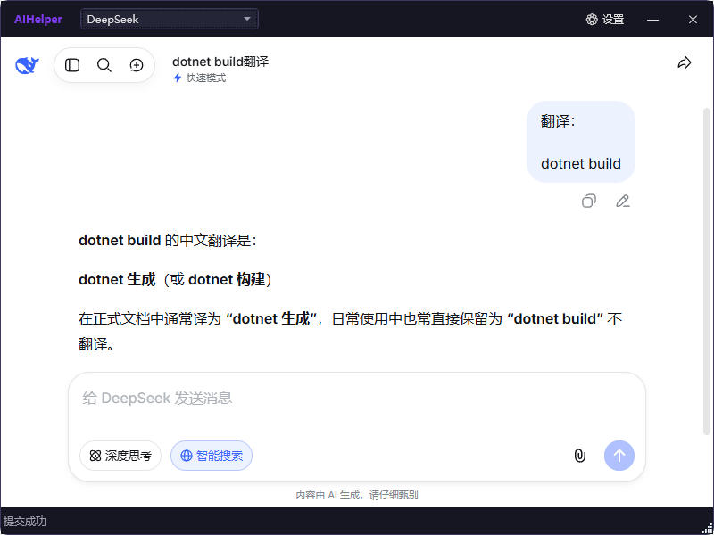
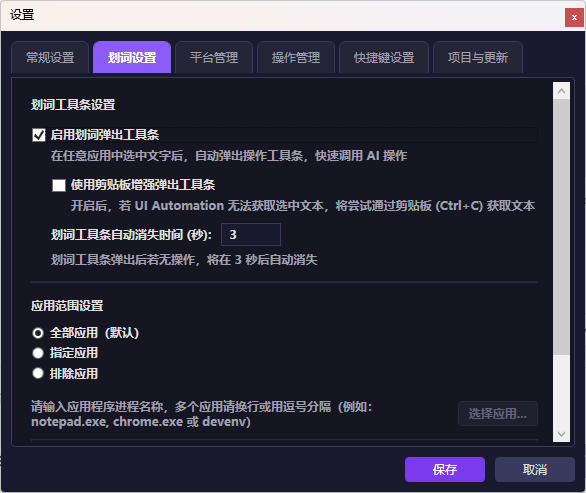
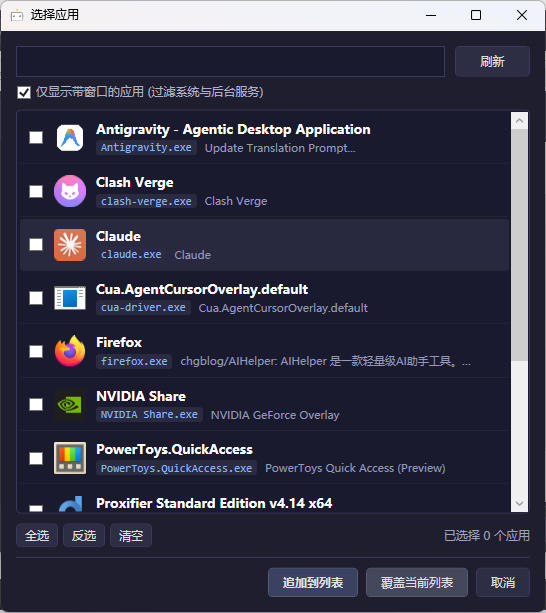
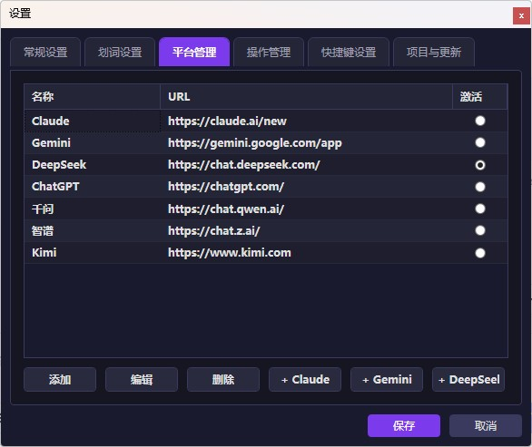
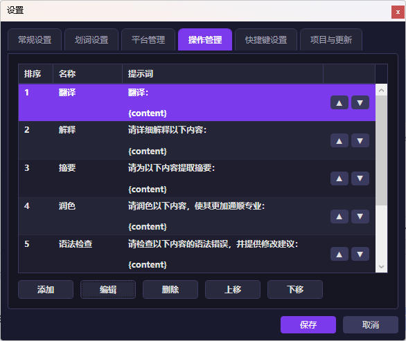
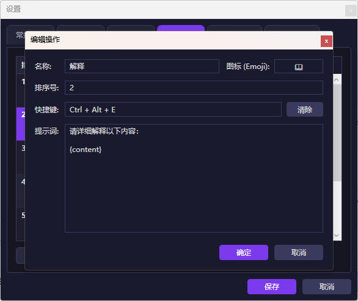

# AIHelper

**中文** | [English](README.md)

AIHelper —— 你的 Windows 全局 AI 效率引擎。

告别繁琐的复制粘贴与窗口切换，AIHelper 将 DeepSeek、通义千问、ChatGPT、Claude、Gemini 等主流大模型无缝嵌入你的工作流。通过 划词即现工具条、全局快捷键 及 智能网页注入，一键完成翻译、解释、摘要、润色与语法检查。轻量、无感、即用即走，让 AI 真正成为你的桌面原生能力。


<a href="https://github.com/chgblog/AIHelper/releases">

</a>

https://github.com/user-attachments/assets/5b0386f3-706b-4be9-bb22-960bb03d147a

---

## 📸 界面展示

### 1. 主窗口（AI 结果显示界面）


### 2. 划词 AI 工具条


### 3. 划词设置


### 4. 划词应用设置


### 5. 平台管理


### 6. 操作管理


### 7. 操作编辑


---

## ✨ 核心特性

- **✨ 划词 AI 助手工具条 (Text Selection Helper)**
  - 在任意软件中用鼠标划词选中文本，自动在光标旁浮现极简 AI 悬浮工具条。
  - 支持直接点击工具条上的 Prompt 动作一键处理选中文本，无需键盘快捷键。
  - **便捷交互与定制**：支持鼠标右键一键关闭工具条；支持在工具条中添加“复制”按钮（可配置不开启、置于首位或末位）；支持配置自动消失时间与动画避让。
  - **应用范围控制**：支持设置“全部应用”、“指定应用”或“排除应用”，并提供可视化的进程选择器窗口。

- **🚀 全局快捷键与动作面板**
  - 按下全局快捷键（默认 `Ctrl+Alt+Space`）调出快捷动作面板。
  - 按下打开主界面快捷键（默认 `Shift+Space`）可随时唤醒或隐藏主窗口（按一次打开/激活置顶，再按关闭，支持循环切换）。
  - 支持划词选中或复制文本后，直接通过快捷键（如 `Ctrl+Alt+T`）一键发送给 AI 处理。
  - **🛡️ 快捷键冲突实时检测**：录入快捷键时实时检测与内置功能键、其他动作以及系统/第三方软件的占用冲突，防止热键失效。
  - 支持在设置界面对所有快捷动作进行**自定义排序**（上移/下移）与独立弹窗编辑。

- **🌐 多 AI 平台集成、独立代理与动作定向路由**
  - 内置 7 大主流 AI 平台预设：**DeepSeek**、**Claude**、**Gemini**、**ChatGPT**、**千问**、**智谱**、**Kimi**。
  - **🔀 动作绑定特定平台**：每个 Prompt 动作均可独立指定使用的 AI 平台（如“翻译”走 DeepSeek、“代码润色”走 Claude，或使用默认激活平台），实现多模型灵活分工。
  - **🌐 平台级独立代理配置**：每个 AI 平台可单独开启或直连代理，灵活应对不同大模型站点的网络要求。
  - **🎯 可视化 DOM 元素拾取器**：支持自定义“新会话”、“输入框”及“提交按钮”的 CSS 选择器；内置 WebView2 拾取模式，悬停/点击网页元素即可自动捕获高精度选择器。
  - **🔄 自动开启新会话**：支持配置“新会话选择器”，在每次发送 Prompt 前自动点击开启全新对话。

- **⚡ 智能 DOM 脚本注入与提交控制**
  - 内置 `injector.js` 脚本，自动识别并定位各大 AI 平台的网页文本输入框。
  - 深度优化跨平台切换时的重试、等待加载与注入机制，确保各种复杂页面下稳定注入并支持**自动提交**开关。

- **🌐 浏览器模式与模仿真人浏览网页**
  - **模式一键切换**：在切换 AI 平台右侧提供浏览器图标，点击即可进入轻量「浏览器模式」；浏览器模式左侧提供 AI 图标，随时无缝切回原先的 AI 模式且完整保留对话会话。
  - **便捷网页访问**：浏览器模式下提供地址栏与访问/刷新按钮，自动补全协议前缀并记忆最后访问网址。
  - **模仿真人随机滚动**：地址栏右侧集成「模拟真人访问」开关。开启后根据设置中的随机间隔时长（如 0.5s - 3s，支持小数）与平滑滚动间距（如 100px - 300px）自动向下模拟人工浏览网页。
  - **模拟访问独立设置**：在设置窗口中新增「模拟访问」独立配置标签页，支持个性化微调滚动时延与移动步长，并提供是否启用代理选项（默认与系统代理一致，勾选则使用常规设置中的网络代理）。
  - **🤖 自动访问与智能链路遍历 (Auto Visit)**：
    - **自动访问管理**：在模拟访问设置中提供独立的「自动访问管理」弹窗界面（类似平台管理），可添加与维护多条自动访问网址规则。
    - **规则配置项**：支持设置自动访问网址、链接正则匹配规则、单轮访问链接数上限、下一页定位选择器（支持可视化元素拾取器点击定位）、以及停止后随机刷新间隔（最小值-最大值分钟，默认 30~60 分钟）。
    - **视口提取与 24 小时排重**：主页面视口内智能匹配可见链接，自动过滤 24 小时内已访问过的网址。
    - **深入子页与原位返回**：按设定的人工浏览参数逐个点击深入子页面并平滑滚动到底部，到底部后自动返回主页面并精准恢复原有滚动位置。
    - **屏进遍历与自动翻页**：当前屏幕匹配链接访问完后自动向下滚屏至下一屏继续遍历；滚动到底部时自动识别并点击「下一页」翻页，翻页后重置到顶部继续循环。
    - **随机间隔自动刷新循环**：达到链接数上限或到底部停止后，根据设置的时长区间随机倒计时等待，倒计时结束后自动刷新重新从头开始访问。


- **🖥️ 主窗口快捷动作栏与现代化窗口体验**
  - **底部状态栏快捷动作**：主界面底部常驻快捷动作按钮栏与“更多 ▾”菜单，在主窗口中可随时一键发起预设 Prompt；左侧支持“开启新会话”勾选项，开启时先自动触发新会话按钮再注入提示词，未开启时直接注入到当前会话。
  - **窗口最大化与还原**：支持主窗口最大化/还原控制以及双击标题栏缩放。

- **📦 配置管理与一键备份/恢复**
  - 支持将所有平台、动作、快捷键及偏好设置一键导出备份为 JSON 文件，或随时导入恢复，并支持快速打开配置所在目录。

- **🔔 自动检查更新与非侵入式提醒**
  - 支持后台自动检测 GitHub Release 新版本；主窗口设置按钮旁显示非侵入式的“有更新”提醒与下载跳转，拒绝打扰。

- **🌐 界面多语言支持 (Internationalization)**
  - 内置语言管理器，支持**简体中文**与 **English** 双语界面随时动态切换，根据时区自动适配。

- **💻 现代且轻量的 UI 与系统托盘**
  - 基于 WPF 构建，结合 Microsoft WebView2 提供流畅的网页浏览与交互体验。
  - 系统托盘图标右键菜单支持快捷「打开设置」、「开启/关闭划词搜索」等便捷控制。
  - 本地化配置存储（保存路径：`%APPDATA%\AIHelper\settings.json`），保护隐私且免去重复登录。

---

## ⌨️ 默认快捷键

| 快捷键 | 动作 / 功能 | 提示词说明 (Prompt) |
| :--- | :--- | :--- |
| `Shift + Space` | 唤醒/隐藏主界面 | 循环切换主窗口显示与隐藏 |
| `Ctrl + Alt + Space` | 唤醒/隐藏快捷动作面板 | 调出动作列表面板选择执行 |
| `Ctrl + Alt + T` | 翻译 (Translate) | 将选中文本翻译为中文 |
| `Ctrl + Alt + E` | 解释 (Explain) | 详细解释选中文本内容 |
| `Ctrl + Alt + S` | 摘要 (Summarize) | 为选中文本提取核心摘要 |
| `Ctrl + Alt + R` | 润色 (Polish) | 润色选中文本使其通顺专业 |
| `Ctrl + Alt + G` | 语法检查 (Grammar) | 检查语法错误并提供修改建议 |
| `Ctrl + Alt + O` | 总结 (Summarize) | 为选中文本生成总结 |

> *注：所有快捷键均可在应用“设置”窗口中重新配置，并支持按键冲突实时检测。*

---

## 🛠️ 技术栈与依赖

- **运行环境 / 框架**：.NET Framework 4.8 / WPF (Windows Presentation Foundation)
- **网页浏览器内核**：[Microsoft.Web.WebView2](https://www.nuget.org/packages/Microsoft.Web.WebView2)
- **JSON 序列化**：[Newtonsoft.Json](https://www.nuget.org/packages/Newtonsoft.Json)
- **单文件打包**：[Costura.Fody](https://www.nuget.org/packages/Costura.Fody)
- **脚本注入桥梁**：Vanilla JavaScript (`injector.js` / `element-picker.js`)

---

## 📁 项目结构

```text
AIHelper/
├── AIHelper.sln                # Visual Studio 解决方案文件
└── AIHelper/
    ├── AIHelper.csproj         # 项目工程文件
    ├── App.xaml / App.xaml.cs  # 应用入口与全局资源 (含系统托盘菜单)
    ├── Assets/
    │   ├── injector.js         # 自动化注入网页的 JS 脚本
    │   └── element-picker.js   # 网页 DOM 元素可视化拾取 JS 脚本
    ├── Converters/             # XAML 数据转换器
    │   ├── BoolToVisibilityConverter.cs
    │   └── PlatformIdToNameConverter.cs
    ├── Models/
    │   ├── ActionItem.cs       # 快捷动作数据模型 (含平台绑定/划词/排序)
    │   ├── AiPlatform.cs       # AI 平台数据模型 (含独立代理/新会话/选择器)
    │   ├── AppItem.cs          # 应用程序数据模型 (用于划词应用范围筛选)
    │   └── AppSettings.cs      # 应用配置与默认设置 (代理/语言/划词设置)
    ├── Services/
    │   ├── AppInfoService.cs   # 应用信息与版本服务
    │   ├── AutoStartService.cs # 开机自启服务
    │   ├── ClipboardService.cs # 剪贴板获取与模拟按键服务
    │   ├── HotkeyService.cs    # 全局 Hotkey 注册与冲突检测服务 (Win32 API)
    │   ├── LanguageManager.cs  # 多语言/国际化 (I18n) 动态切换服务
    │   ├── Logger.cs           # 日志记录服务
    │   ├── PageInjector.cs     # 网页 JS 脚本注入与执行服务
    │   ├── SettingsService.cs  # 本地 JSON 配置加载、持久化与备份恢复
    │   ├── TextSelectionService.cs # 划词选中文本与悬浮工具条监听服务
    │   └── UpdateCheckService.cs   # GitHub Release 新版本检测服务
    └── Views/
        ├── ActionEditWindow.xaml   # 快捷动作独立编辑窗口 (支持指定平台)
        ├── ActionPanelControl.xaml # 快捷动作悬浮面板视图
        ├── AppSelectionWindow.xaml # 划词目标应用可视化选择窗口
        ├── ElementPickerWindow.xaml# 网页 DOM 元素可视化拾取窗口
        ├── MainWindow.xaml         # 主界面 (含 WebView2 控件与底部快捷栏)
        ├── PlatformEditWindow.xaml # 平台编辑与元素定位配置窗口 (含代理设置)
        ├── SelectionToolbarWindow.xaml # 划词 AI 悬浮工具条窗口
        └── SettingsWindow.xaml     # 设置界面 (平台/动作/划词/其他/更新配置)
```

---

## 🚀 编译与运行

### 1. 前置条件

- **操作系统**：Windows 10 / Windows 11
- **开发工具**：Visual Studio 2019 / 2022（需安装 **.NET 桌面开发** 工作负载）或 .NET SDK
- **SDK 要求**：.NET Framework 4.8 Developer Pack
- **运行时需求**：[Microsoft Edge WebView2 Runtime](https://developer.microsoft.com/en-us/microsoft-edge/webview2/)（Win11 已内置，Win10 通常随 Edge 自动安装）

### 2. 构建步骤

1. 克隆或下载本项目源码至本地：
   ```bash
   git clone https://github.com/chgblog/AIHelper.git
   cd AIHelper
   ```
2. 使用 Visual Studio 打开 `AIHelper.sln`。
3. 在 Visual Studio 顶部菜单选择 `Any CPU` 或 `x64` 平台，解决方案配置选择 `Debug` 或 `Release`。
4. 按下 `F5` 键运行或按 `Ctrl+Shift+B` 编译解决方案。

### 3. 单文件打包 (Single EXE Packaging)

本项目已集成 **Costura.Fody**，支持将依赖 DLL 及 `injector.js` 静态资源全部合并为单个独立的 `.exe` 文件：

- **通过命令行编译发布**：
   ```bash
   dotnet build AIHelper/AIHelper.csproj -c Release
   ```
- **生成产物**：
   打包后的单文件位于 `AIHelper/bin/Release/net48/AIHelper.exe`。您可以直接将 `AIHelper.exe`（及其同级配置文件 `AIHelper.exe.config`）复制到任意位置独立运行，无需附带任何 DLL 或 `Assets/` 资源目录。

---

## 验证来自 Github Action 打包

验证下载文件由 Github Action 通过源码自动编译打包。

- **校验文件哈希（Windows PowerShell）：**
```
Get-FileHash .\AIHelper.zip -Algorithm SHA256
```

- **验证 GitHub 官方构建存证（使用 GitHub CLI）：**
```
gh attestation verify AIHelper.zip --repo chgblog/AIHelper
```

## 🔗 友情链接 

- **[linux.do](https://linux.do)** - 没事儿就想去逛逛的社区

## 📄 许可协议

基于 [GNU 通用公共许可证 v3.0（GPL-3.0）](LICENSE) 发布。
